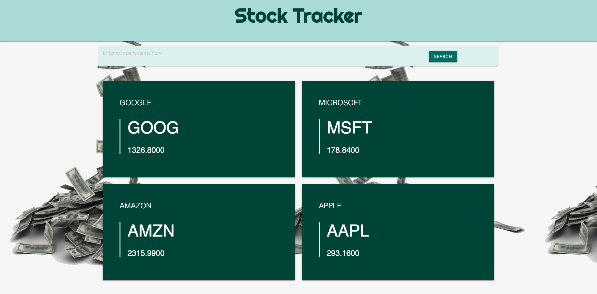
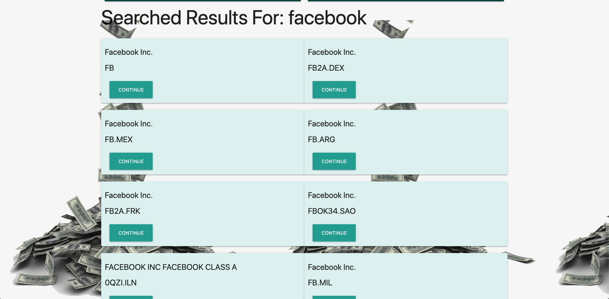

# Unit 07: Project 1

## Stock-Tracker
Link to web page: https://jtousley999.github.io/Stock-Tracker/

## Team Members
* Artur Ayzenberg (@artbor19)
* Jon Tousley (@Jtousley999)
* Preston Keomany (@prestonkeo)
* Sammy Sloan (@slsloan)

## Project Description

### Overview:
 The application will provide a search engine to find specific stock data and relating articles to that stock.

```
AS A financial advisor
I WANT to see stock information
SO THAT I can determine whether to buy or sell that stock
```





### Technology/Framework:

* jQuery / AJAX
* HTML
* CSS
* JavaScript
* Materialize (https://materializecss.com/)

### API Reference: 
* Alpha Vantage (NEW) (https://www.alphavantage.co/)
* New York Times (https://developer.nytimes.com/)

## Copyright:

Artur Ayzenberg, Jon Tousley, Preston Keomany, Sammy Sloan

© 2020 All Rights Reserved